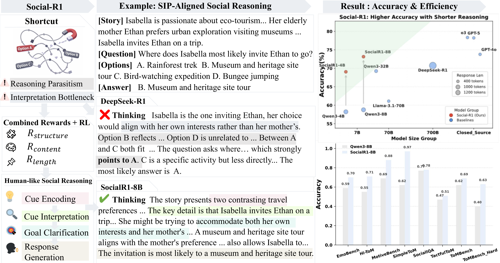

# Social-R1: Enhancing Social Reasoning in LLMs through Trajectory-Level Reinforcement Learning

<a href="https://arxiv.org/abs/2603.09249" target="_blank"></a>
<a href="https://huggingface.co/datasets/Jincenzi/ToMBench_Hard" target="_blank"></a>
<a href="https://huggingface.co/Jincenzi/SocialR1-4B" target="_blank"></a>
<a href="https://huggingface.co/Jincenzi/SocialR1_8B" target="_blank"></a>
<a href="https://huggingface.co/Jincenzi/SocialR1-Llama3.1-8B" target="_blank"></a>



## TLDR
While LLMs achieve strong performance on social reasoning benchmarks, they often rely on shortcuts rather than grounded social inference. We identify two core failure modes: **Reasoning Parasitism** (models prematurely anchor on answer options and construct post-hoc justifications) and the **Interpretation Bottleneck** (models fail to map social cues to latent mental states). We propose **Social-R1**, a reinforcement learning framework that aligns LLM reasoning at the trajectory level. Inspired by Social Information Processing (SIP) theory, Social-R1 introduces a multi-dimensional reward design that supervises both reasoning structure and content quality, encouraging stage-consistent and narrative-grounded social inference. We also construct **ToMBench-Hard**, a challenging ToM dataset with 800 expert-annotated adversarial questions, and train a dedicated **SIP Content Reward Model** on **SocialPairs-20K**. Extensive experiments across static MCQ benchmarks (8 benchmarks), open-ended generation (FanToM), and interactive settings (SOTOPIA) show that Social-R1 improves stage consistency and grounding quality, enabling smaller models to match or outperform substantially larger baselines.

## Key Features

- 🧠 **ToMBench-Hard Benchmark**: 800 expert-annotated adversarial questions covering six Theory-of-Mind dimensions (Belief, Desire, Emotion, Intention, Knowledge, Non-literal Communication) designed to expose reasoning shortcuts
- 🎯 **Multi-Dimensional Reward System**: Combines SIP structural reward ($R_\text{struct}$), SIP content reward ($R_\text{cont}$), inference efficiency ($R_\text{len}$), and format reward ($R_\text{fmt}$) with curriculum-style weighting to supervise the entire reasoning trajectory
- 🔬 **SIP-Guided Reasoning**: Enforces stage-consistent social inference following the Social Information Processing framework: Cue Encoding → Cue Interpretation → Goal Clarification → Response Generation
- 🚀 **Cross-Family Generalisation**: Applied to Qwen3-4B, Qwen3-8B, and Llama-3.1-8B-Instruct, demonstrating backbone-agnostic improvements
- 📊 **Comprehensive Evaluation**: Validated across three complementary settings — static MCQ (8 benchmarks including ToMBench, ToMBench-Hard, SocialIQA, SimpleToM, EmoBench, MotiveBench, Hi-ToM, TactfulToM), open-ended generation ([FanToM](https://arxiv.org/abs/2310.15421)), and interactive social intelligence ([SOTOPIA](https://arxiv.org/abs/2310.11667))
- 📈 **Process-Level Social Alignment**: Empirical evidence that aligning intermediate social reasoning processes promotes more faithful inference beyond output-only optimisation

## 📢 News
- **[2026.05.11]** 🎉 Social-R1 paper accepted to **NeurIPS 2026**! Paper updated with new results.
- **[2026.05.11]** 🎉 Model checkpoints released: [SocialR1-4B](https://huggingface.co/Jincenzi/SocialR1-4B) | [SocialR1-8B](https://huggingface.co/Jincenzi/SocialR1_8B) | [SocialR1-Llama3.1-8B](https://huggingface.co/Jincenzi/SocialR1-Llama3.1-8B)
- **[2026.03.10]** 🎉 Social-R1 paper released on arXiv!

## TODO List
- [x] Release the paper.
- [x] Release ToMBench-Hard evaluation set.
- [x] Release training and evaluation code.
- [x] Release model checkpoints (SocialR1-4B, SocialR1-8B, SocialR1-Llama3.1-8B).


## Installation

### 0. Initialise Submodules and Conda Environments

```bash
bash ./scripts/setup/init_submodules.sh
```
This script initialises all required submodules and creates the `verl` conda environment.

### 1. Clone verl Repository

```bash
cd submodules
git clone https://github.com/verl-project/verl.git
```

### 2. Overwrite verl with Project Modifications

```bash
bash ./scripts/setup/overwrite_verl.sh
```

### 3. Start LLM Server (for reward evaluation)

```bash
bash ./scripts/setup/llm_server_gpt.sh
```

## Training

Social-R1 is trained using [verl](https://github.com/verl-project/verl) with Group Relative Policy Optimization (GRPO). Training scripts are located in `verl_overwrite/grpo_trainer/`.

### Full Social-R1 Training

```bash
bash run_socialR1_4B.sh
```

 

> **Note:** All training scripts are configured for **4B models** (Qwen3-4B) by default. Training is performed for 600 steps on 8× NVIDIA A100 (80GB) GPUs with group size 5, KL coefficient 0.04, and learning rate 5×10⁻⁷.

 

## Project Structure

```
SocialR1/
├── asset/                        # Figures and assets
├── dataset/
│   └── ToMBench_Hard_val.csv     # ToMBench-Hard validation set
├── scripts/
│   └── setup/
│       ├── init_submodules.sh    # Environment setup
│       ├── llm_server_gpt.sh    # LLM server for reward
│       └── overwrite_verl.sh    # Apply verl modifications
└── verl_overwrite/
    ├── grpo_trainer/             # Training scripts
    │   ├── run_socialR1_4B.sh
    │   ├── run_socialR1_4B_GRPO.sh
    │   ├── run_socialR1_4B_content.sh
    │   ├── run_socialR1_4B_len.sh
    │   └── run_socialR1_4B_structure.sh
    ├── reward_score/             # Reward computation
    │   ├── qa_em_and_format.py   # Format & outcome reward
    │   ├── llm_evaluate.py       # LLM-based evaluation
    │   ├── llm_eval_prompt.py    # Evaluation prompts
    │   └── utils_metric.py       # Metric utilities
    ├── fs.py                     # Few-shot utilities
    ├── naive.py                  # Naive baseline
    └── ray_trainer.py            # Ray-based trainer
```

## Citation
```BibTeX
@inproceedings{wu2026socialr1,
  title={Social-R1: Enhancing Social Reasoning in LLMs through Trajectory-Level Reinforcement Learning},
  author={Wu, Jincenzi and Lei, Yuxuan and Lian, Jianxun and Huang, Yitian and Zhou, Lexin and Li, Haotian and Yang, Deng and Xie, Xing and Meng, Helen},
  booktitle={Advances in Neural Information Processing Systems (NeurIPS)},
  year={2026}
}
```

## Contact
If you have any questions or would like to discuss this work, please contact the authors at [jincenziwu@gmail.com](mailto:jincenziwu@gmail.com).
